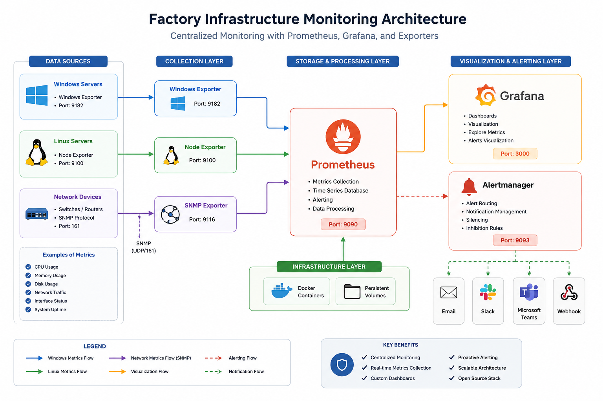
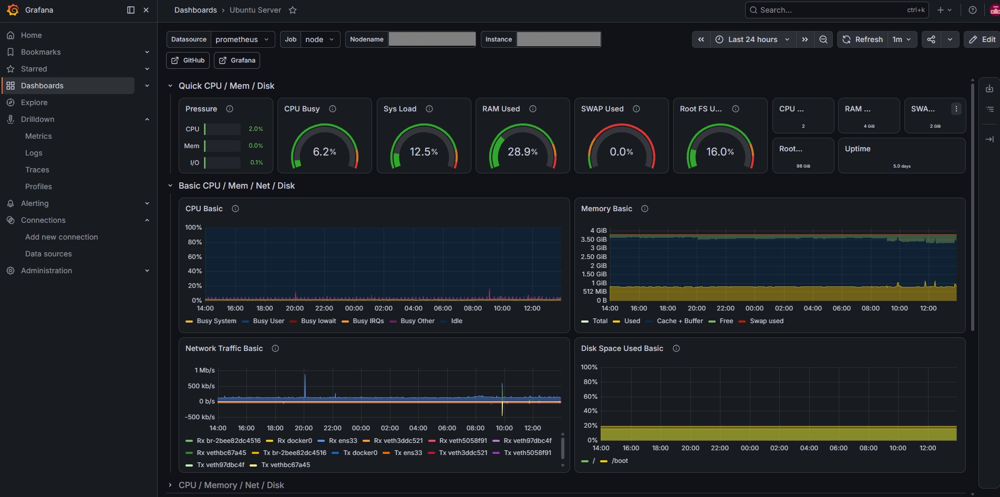
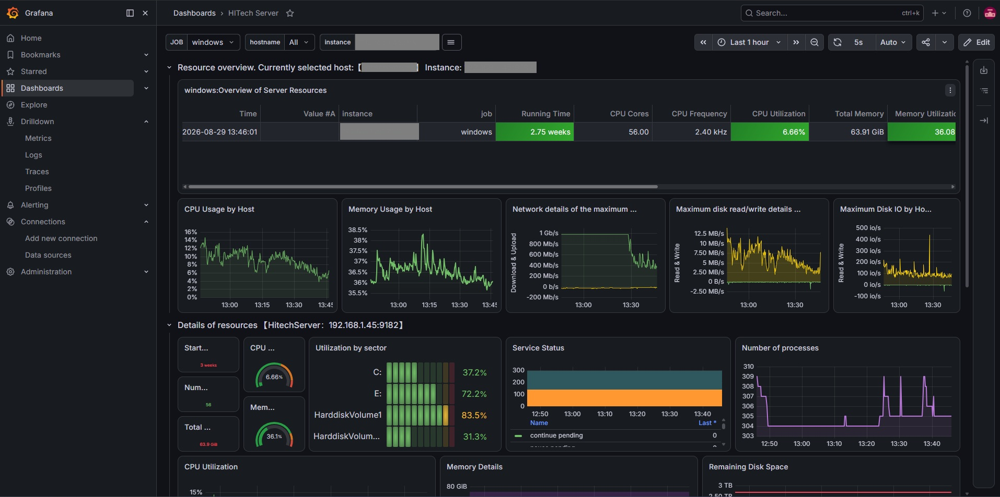
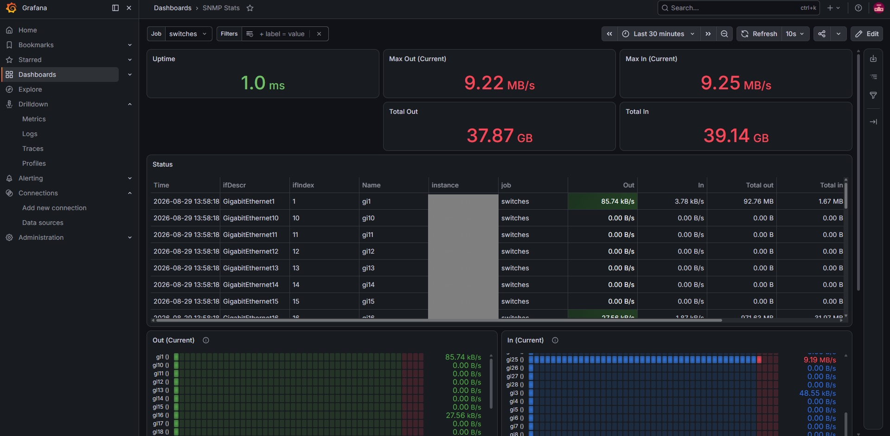
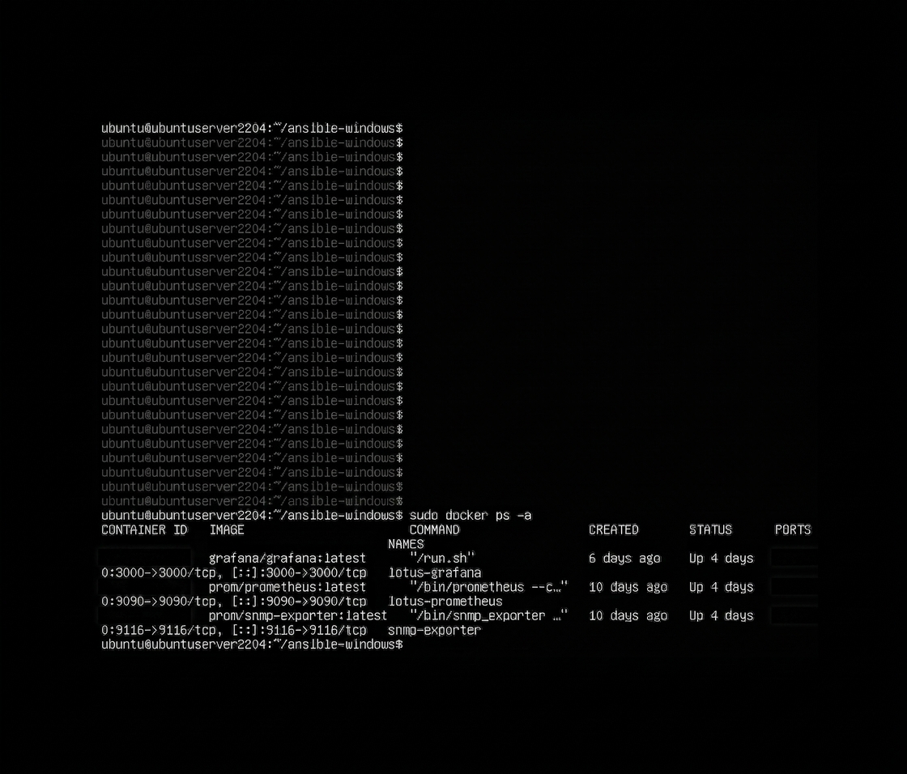

# 🚀 Factory Infrastructure Monitoring

A centralized infrastructure monitoring solution built with **Prometheus, Grafana, Docker, SNMP Exporter, Windows Exporter, and Node Exporter**.

The project is designed to monitor **Linux servers, Windows machines, and network devices** from a centralized monitoring platform.

> 🔒 **Security Notice:** This repository is a sanitized portfolio version. No real production IP addresses, credentials, SNMP communities, internal domain names, or sensitive factory information are included.

---

## 🏗️ Architecture



The monitoring architecture consists of multiple data sources connected to a centralized Prometheus server.

### Monitoring Flow

```text
Linux Servers
     │
     ▼
Node Exporter
     │
     │
Windows Servers
     │
     ▼
Windows Exporter
     │
     │
Network Devices
     │
     ▼
SNMP Exporter
     │
     ▼
Prometheus
     │
     ▼
Grafana
     │
     ▼
Monitoring Dashboards
```

---

## 🛠️ Technologies Used

| Technology          | Purpose                           |
| ------------------- | --------------------------------- |
| 🐳 Docker           | Containerization                  |
| 📊 Prometheus       | Metrics collection and monitoring |
| 📈 Grafana          | Visualization and dashboards      |
| 🪟 Windows Exporter | Windows system metrics            |
| 🐧 Node Exporter    | Linux system metrics              |
| 🌐 SNMP Exporter    | Network device monitoring         |
| 🐧 Ubuntu           | Monitoring server                 |
| 📝 YAML             | Configuration                     |

---

## 📊 Monitoring Capabilities

### 🐧 Linux Monitoring

Linux servers are monitored using **Node Exporter**.

The dashboard provides visibility into:

* CPU utilization
* Memory usage
* Disk usage
* Network traffic
* System performance
* Server availability



---

### 🪟 Windows Monitoring

Windows machines are monitored using **Windows Exporter**.

The monitoring system provides information about:

* CPU usage
* Memory utilization
* Disk usage
* Network activity
* System performance
* Windows server availability



---

### 🌐 Network Monitoring

Network devices such as switches and routers are monitored using **SNMP Exporter**.

The monitoring solution provides visibility into:

* Interface status
* Network traffic
* Packets
* Interface errors
* Network utilization
* Device availability



---

## 🔥 Prometheus

Prometheus is responsible for collecting and storing time-series metrics from the different exporters.

Example monitored targets include:

* Linux servers
* Windows servers
* Network devices
* Prometheus itself


---

## 🐳 Docker Deployment

The monitoring stack runs using **Docker Compose**.

The main containers include:

```text
Prometheus
Grafana
SNMP Exporter
```

Example Docker environment:



---

## 📁 Project Structure

```text
factory-infrastructure-monitoring/
│
├── README.md
├── docker-compose.yml
├── .gitignore
│
├── prometheus/
│   └── prometheus.yml
│
├── snmp/
│   └── snmp.yml
│
├── grafana/
│   ├── dashboards/
│   │   └── infrastructure-monitoring.json
│   │
│   └── provisioning/
│       └── datasources/
│           └── datasource.yml
│
├── screenshots/
│   ├── grafana-linux.png
│   ├── grafana-switch.png
│   ├── grafana-windows.png
│   ├── prometheus.png
│   └── docker-ps.png
│
└── docs/
    └── architecture.png
```

---

## 🚀 Deployment

### 1. Clone the Repository

```bash
git clone https://github.com/Barakat456/factory-infrastructure-monitoring.git
```

### 2. Enter the Project Directory

```bash
cd factory-infrastructure-monitoring
```

### 3. Start the Monitoring Stack

```bash
sudo docker compose up -d
```

### 4. Check Running Containers

```bash
sudo docker ps -a
```

### 5. Access the Services

Prometheus:

```text
http://<server-ip>:9090
```

Grafana:

```text
http://<server-ip>:3000
```

> Replace `<server-ip>` with the IP address of your own monitoring server.

---

## 💾 Data Persistence

Docker volumes are used to preserve monitoring data and Grafana configuration.

```text
Prometheus
    │
    ▼
Persistent Volume

Grafana
    │
    ▼
Persistent Volume
```

This helps maintain monitoring data and Grafana configuration even after container restarts.

---

## 🔐 Security Considerations

The production environment contains sensitive infrastructure information, therefore this public repository has been sanitized.

The repository does **not** contain:

* ❌ Production IP addresses
* ❌ Passwords
* ❌ API tokens
* ❌ Real SNMP communities
* ❌ Internal domain names
* ❌ Production hostnames
* ❌ Private credentials

All configuration examples are intended for demonstration purposes.

---

## 🧠 Skills Demonstrated

This project demonstrates practical experience in:

* Linux Administration
* Docker
* Docker Compose
* Infrastructure Monitoring
* Prometheus
* Grafana
* SNMP
* Windows Monitoring
* Linux Monitoring
* Network Monitoring
* Troubleshooting
* Containerization
* Observability
* Infrastructure Management

---

## 🎯 Project Goals

The main goals of this project are:

* Centralize infrastructure monitoring
* Improve visibility into server performance
* Monitor Windows and Linux systems
* Monitor network infrastructure
* Visualize infrastructure metrics
* Detect infrastructure issues
* Build a scalable monitoring architecture
* Apply DevOps monitoring and observability practices

---

## 📌 Future Improvements

Possible future improvements include:

* 🚨 Prometheus Alertmanager
* 📧 Email notifications
* 💬 Slack / Microsoft Teams notifications
* 🔧 Ansible-based exporter deployment
* ☸️ Kubernetes deployment
* 🔄 CI/CD integration
* 📊 Additional Grafana dashboards
* 🔐 Improved secrets management

---

## 👨‍💻 Author

👨‍💻 Author

Mohamed Barakat

DevOps Engineer 
